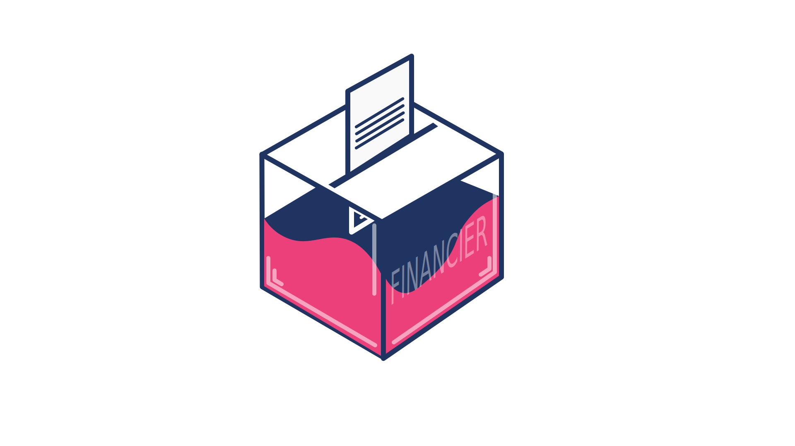
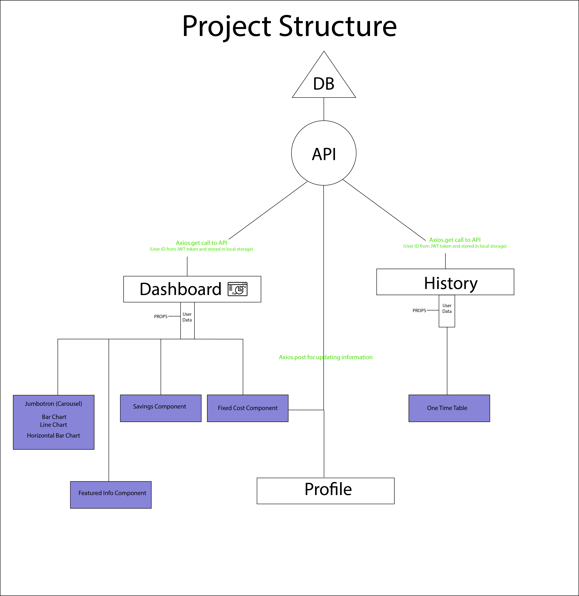

<!--
*** Thanks for checking out the Best-README-Template. If you have a suggestion
*** that would make this better, please fork the repo and create a pull request
*** or simply open an issue with the tag "enhancement".
*** Don't forget to give the project a star!
*** Thanks again! Now go create something AMAZING! :D
-->

<!-- PROJECT SHIELDS -->
<!--
*** I'm using markdown "reference style" links for readability.
*** Reference links are enclosed in brackets [ ] instead of parentheses ( ).
*** See the bottom of this document for the declaration of the reference variables
*** for contributors-url, forks-url, etc. This is an optional, concise syntax you may use.
*** https://www.markdownguide.org/basic-syntax/#reference-style-links
-->

[![Contributors][contributors-shield]][contributors-url]
[![Forks][forks-shield]][forks-url]
[![Stargazers][stars-shield]][stars-url]
[![Issues][issues-shield]][issues-url]
[![MIT License][license-shield]][license-url]
[![LinkedIn][linkedin-shield]][linkedin-url]

<!-- PROJECT LOGO -->
 

  

<h3 align="center">Financier</h3>
<h3> Link to fully hosted project with backend - <a href="https://financier-sys.herokuapp.com">https://financier-sys.herokuapp.com</a> <h3>

  

     
    <a href="https://github.com/Zuhu162/financier-complete"><strong>Explore the docs »</strong></a>
     
     
    <a href="https://financier-sys.herokuapp.com/">View Demo</a>
    ·
    <a href="https://github.com/Zuhu162/financier-complete/issues">Report Bug</a>
    ·
    <a href="https://github.com/Zuhu162/financier-complete/issues">Request Feature</a>
  

<!-- TABLE OF CONTENTS -->

  
Table of Contents

  <ol>
    <li>
      <a href="#about-the-project">About The Project</a>
      <ul>
        <li><a href="#built-with">Built With</a></li>
      </ul>
    </li>
    <li>
      <a href="#getting-started">Getting Started</a>
    </li>
    <li><a href="#usage">Usage</a></li>
    <li><a href="#roadmap">Roadmap</a></li>
    <li><a href="#contributing">Contributing</a></li>
    <li><a href="#license">License</a></li>
    <li><a href="#contact">Contact</a></li>
    <li><a href="#new-things-learnt">New Things Learnt</a></li>
  </ol>

<!-- ABOUT THE PROJECT -->

## About The Project

[![Product Name Screen Shot][product-screenshot]](https://financier-sys.herokuapp.com)

<h3>An app made using ReactJS, ExpressJS and MongoDB that displays and helps to visualize the user's financial transactions. <h3>  
<h4>Highlights -   🟦Only one axios call in the Dashboard to the API. All the data is passed on to the components through props. 🟩Only one Model in the Database that encapsulates all base user data  🟪All calculations for graphs and charts are calculated on the client-side   Full details of libraries and frameworks used can be found on the section below.  
The project's main focus was on building a real-life app that can be used to solve a daily problem like managing finance.    </h4>  

(<a href="#top">back to top</a>)

### Built With

Front End

- [React.js](https://reactjs.org/)
- [MaterialUI](https://mui.com/)
- [Bootstrap](https://getbootstrap.com/)
- [Recharts](https://recharts.org/)
- [Lodash](https://lodash.com/)
- [Axios](https://github.com/axios/axios)

 

### Built With

Backend

- [Node.js](https://nodejs.org/en/)
- [MongoDB](https://www.mongodb.com/)
- [Mongoose](https://mongoosejs.com/)
- [JSON Web Tokens](https://jwt.io/)
- [Bcrypt](https://www.npmjs.com/package/bcrypt)

(<a href="#top">back to top</a>)

<!-- GETTING STARTED -->

## Getting Started

The app is fully hosted on Heroku - <a>https://financier-sys.herokuapp.com/</a>.
You can sign up for a new account or use an existing account with data from the past 5 months to better understand the UI: 

<h4>Username: test2, Password: 1234</h4>

(<a href="#top">back to top</a>)

<!-- USAGE EXAMPLES -->

<!-- ## Usage

<h3></h3>

<h4>The PieChart(From recharts) represents the number of clients each Sales Representatives have. The values are stored by referencing each client to their respective sales rep's unique id. Thus, creating a one to many relationship between sales reps and clients.</h4>

<h4>The noticeboard is a feature that is composed of MUI and can be used to pin important highlights and messages. It automatically takes the username from the logged in user's Json Web Token.</h4>

<h4>Also a Rechart component, this displays the number of clients gained in certain years and is updated whenever a new client is added.</h4>

<h4>Displays the number of employees that are currently in the database. With custom sorting, filtering and pagination that is implemented using pure javascript.  I used pure javascript algorithms to find out how these features are actually implemented in apps</h4>

<h4>New employees and clients can be added into the database using this form. However, new employees can only be added using Admin accounts</h4>

(<a href="#top">back to top</a>)
 -->

## New Things learnt

- Using embedded documents in MongoDB
- Querying more complex documents in MongoDB
- Better understanding of JavaScript Date object
- Implementing and modelling relationships between different data
- Calculations of data on the client side

(<a href="#top">back to top</a>)

## Contact

Email - zuhayersiddique162@gmail.com  
Project Link: [https://github.com/Zuhu162/financier-complete](https://github.com/Zuhu162/financier-complete)  
See the [open issues](https://github.com/Zuhu162/financier-complete/issues) for a full list of proposed features (and known issues).

(<a href="#top">back to top</a>)

[contributors-shield]: https://img.shields.io/github/contributors/Sandwizard16/dund-sys_client.svg?style=for-the-badge
[contributors-url]: https://github.com/Zuhu162/financier-complete/graphs/contributors
[forks-shield]: https://img.shields.io/github/forks/Sandwizard16/dund-sys_client.svg?style=for-the-badge
[forks-url]: https://github.com/Zuhu162/financier-complete/network/members
[stars-shield]: https://img.shields.io/github/stars/Sandwizard16/dund-sys_client.svg?style=for-the-badge
[stars-url]: https://github.com/Zuhu162/financier-complete/stargazers
[issues-shield]: https://img.shields.io/github/issues/Sandwizard16/dund-sys_client.svg?style=for-the-badge
[issues-url]: https://github.com/Zuhu162/financier-complete/issues
[license-shield]: https://img.shields.io/github/license/Sandwizard16/dund-sys_client.svg?style=for-the-badge
[license-url]: https://github.com/Zuhu162/financier-complete/blob/master/LICENSE.txt
[linkedin-shield]: https://img.shields.io/badge/-LinkedIn-black.svg?style=for-the-badge&logo=linkedin&colorB=555
[linkedin-url]: https://linkedin.com/in/linkedin_username
[product-screenshot]: ./client/src/assets/Dashboard.JPG
[product-structure]: ./client/src/assets/ps.svg
